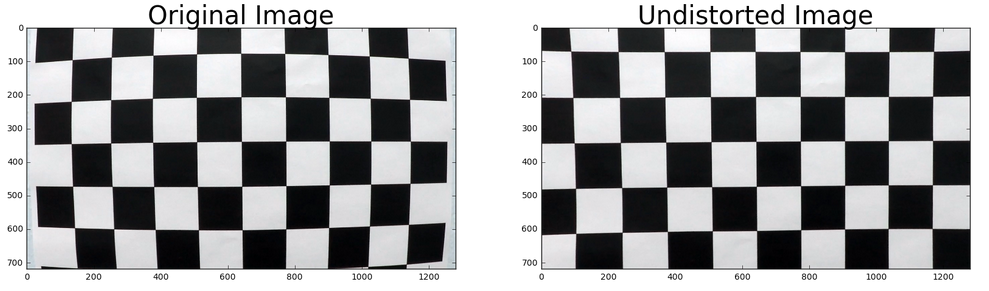
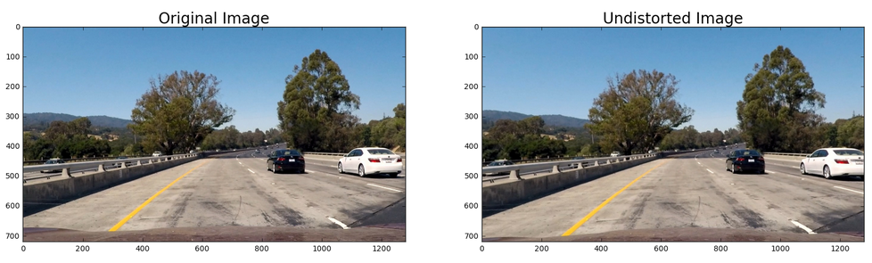
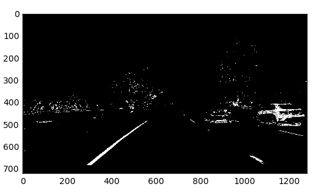
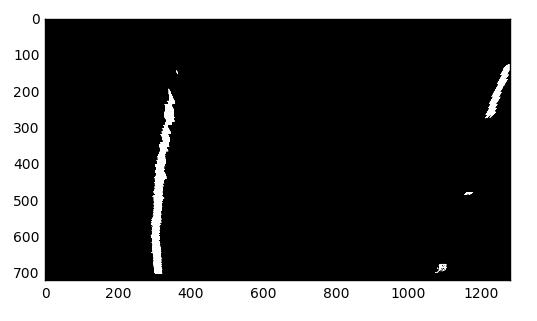
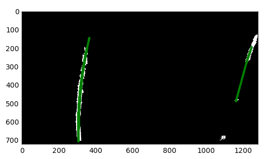
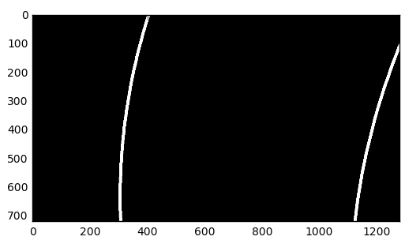
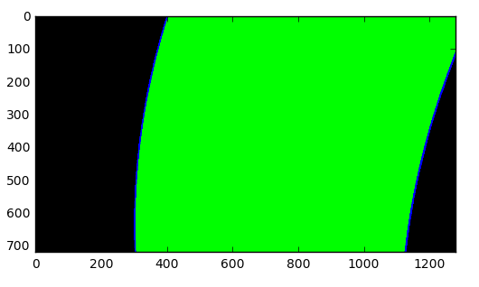
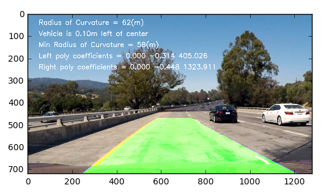

# Advance Lane Detection Project Report
***

_The code referenced in this markdown is from [this IPython notebook](./Advanced_Lane_lines.ipynb)._


## Goals and Objectives
---

The goals / steps of this project are the following:
1. Camera Calibration
    1.    Compute the camera calibration matrix and distortion coefficients given a set of chessboard images.
1. Image pipeline
    1.    Apply the distortion correction to the raw image.
    1.    Use color transforms, gradients, etc., to create a thresholded binary image.
    1.    Apply a perspective transform to rectify binary image ("birds-eye view").
    1.    Detect lane pixels and fit to find lane boundary.
    1.    Determine curvature of the lane and vehicle position with respect to center.
    1.    Warp the detected lane boundaries back onto the original image.
1. Video Pipeline
    1.    Output visual display of the lane boundaries and numerical estimation of lane curvature and vehicle position.


## 1) Camera Calibration
---

### A. Compute the camera calibration matrix and distortion coefficients given a set of chessboard images

First I read all the images using the ``glob` api and initialize the variables `obj_points` and `img_points`. I define a function that takes an image, object points, and image points as input and returns the undistorted image.

In the next cell I generate the "object points" as objp and detect the "image points" as corners and store them in their respective variables. After that I call the `cal_undistort` function to obtain distortion coefficients and then I save the data in a pickle file.

Assumptions
1. The chessboard is fixed on the (x, y) plane at z=0, such that the object points are the same for each calibration image.
1. All images have 6 rows and 9 columns (mentioned in the project rubric)




## 2) Image pipeline
---
<sub>Section 2 References https://github.com/jessicayung/self-driving-car-nd/blob/master/p4-advanced-lane-lines</sub>


### A. Distortion-corrected images

Using the `mtx` and `dist` parameters calculated in the previous step, the raw image from the video is undistorted using `cv2.undistort` function. 
#### Example of a distortion corrected image.



### B. Use color transforms, gradients, etc., to create a thresholded binary image.

I then use the `apply_threshold` function in the `utils` library to get a binary image. It follows the following steps 
* Threshold x gradient (for grayscaled image)
* Threshold colour channel (S channel)
* Combine the two binary thresholds to generate a binary image.
* The parameters (e.g. thresholds) were determined via trial and error.

#### Example of a thresholded binary image



### C. Apply a perspective transform to rectify binary image ("birds-eye view").

The transform was applied only on a section of the image, the coordinates for which were set as 
```
 [(120,img_size[1]),
 (550, 420),
 (700, 420),
 (1160,img_size[1])]
```

After this the perspective transformation was done using following source and destination points.
Source Points:
```
[120, 720],
[550, 470],
[700, 470],
[1160, 720]
```

Destination Points:
```
[200,720],
[200,0],
[1080,0],
[1080,720]
```

#### Example of a thresholded binary image


### D. Detect lane pixels and fit to find lane boundary.

First, I Identify the lane line pixels by dividing the image into `n` horizontal strips of equal height, then take a count of all the pixels at each x-value within the step window using a histogram generated from `np.sum`. Finally use scipy.signal to smoothen the histogram and find the peaks in the left and right halves
Next, I use `np.polyfit` to fit a second order polynomial to each lane line.



Use `draw_poly` function from utils to highlight the lane lines:


Highlight the lane line area




### E. Determine curvature of the lane and vehicle position with respect to center.

Determine curvature of the lane. Define y-value where we want radius of curvature. I chose the maximum y-value, corresponding to the bottom of the image
```
y_eval = 500
left_curverad = np.absolute(((1 + (2 * left_coeffs[0] * y_eval + left_coeffs[1])**2) ** 1.5) \
                /(2 * left_coeffs[0]))
right_curverad = np.absolute(((1 + (2 * right_coeffs[0] * y_eval + right_coeffs[1]) ** 2) ** 1.5) \
                 /(2 * right_coeffs[0]))
```


### F. Warp the detected lane boundaries back onto the original image.

Warp lane boundaries back onto original image



## 3. Video Pipeline
---

I consolidated everything above into a single function and used it to generate the video output.	

The final video of the pipeline implementation can be accessed [here](https://youtu.be/SBtrVh3V3g8).
[](https://youtu.be/SBtrVh3V3g8)


# Discussion
---
The code performs elatively well for the sample video but fails on the challenge and harder challenge videos. This occurs mainly because the variations in the illumination for those videos. It can be corrected by tunig the x gradient and the S channel thresholds. Further improvements are possible by nrmalizing the images beforehand 